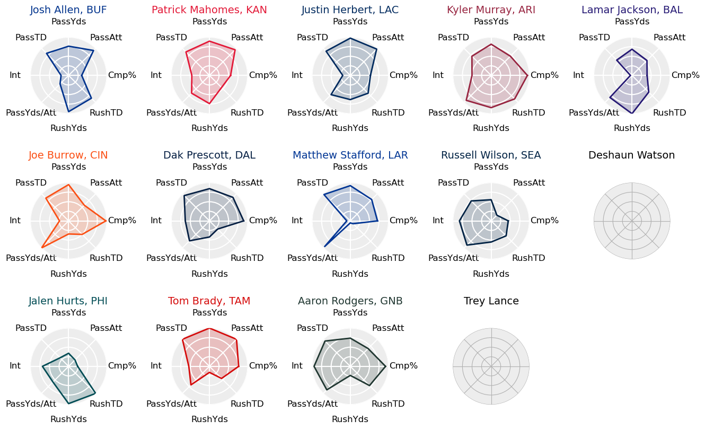
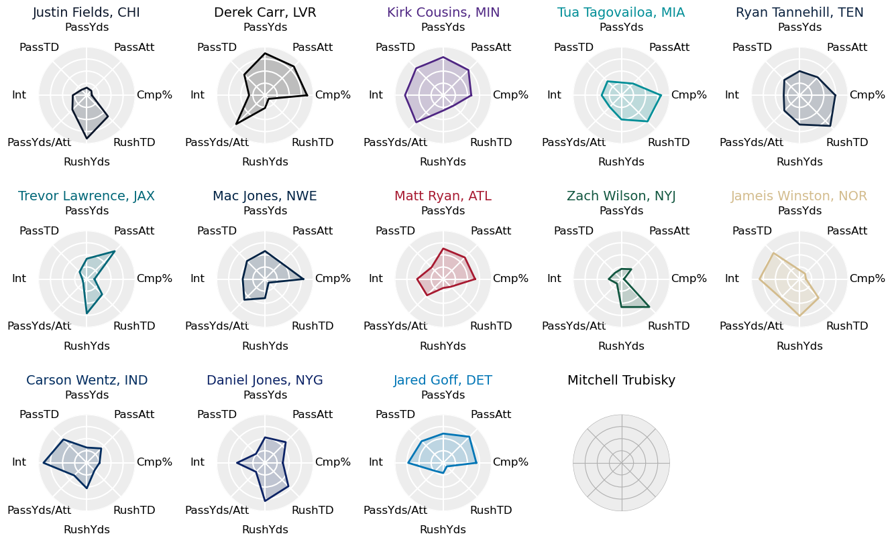
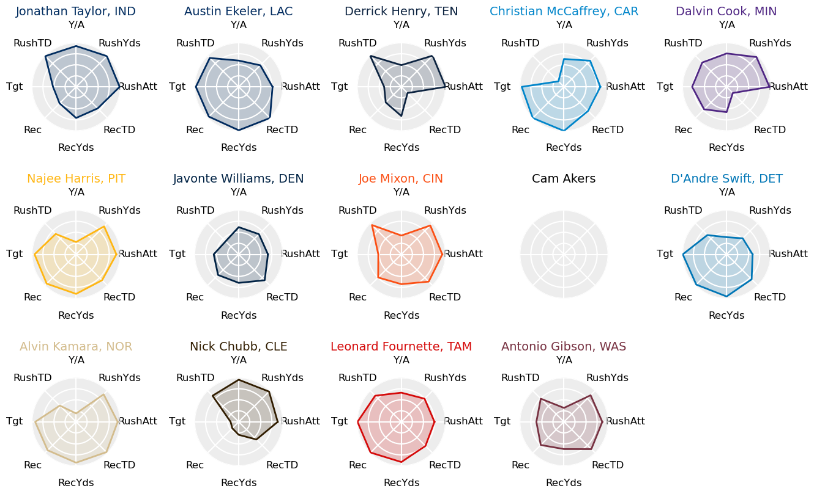
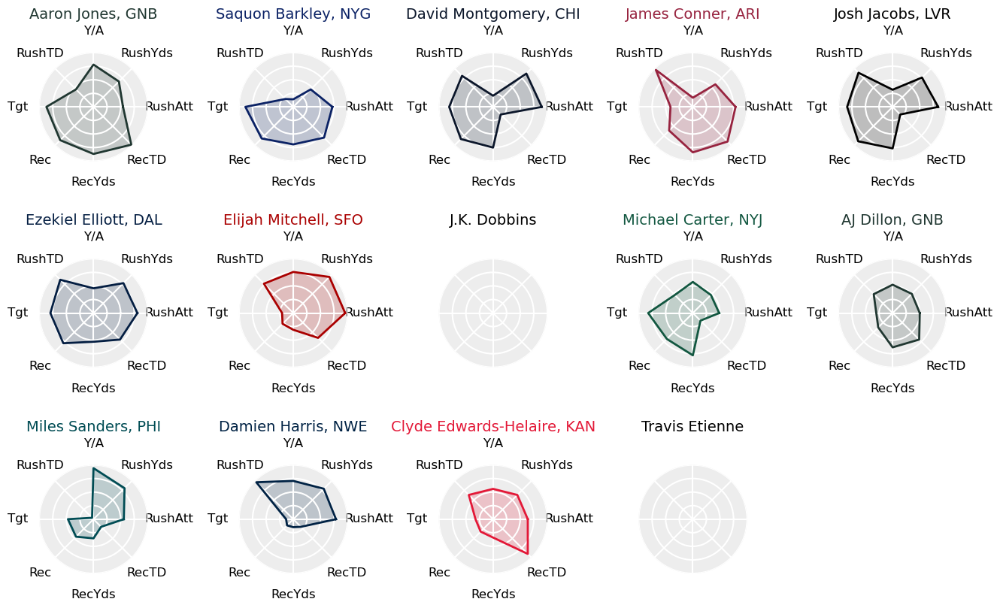
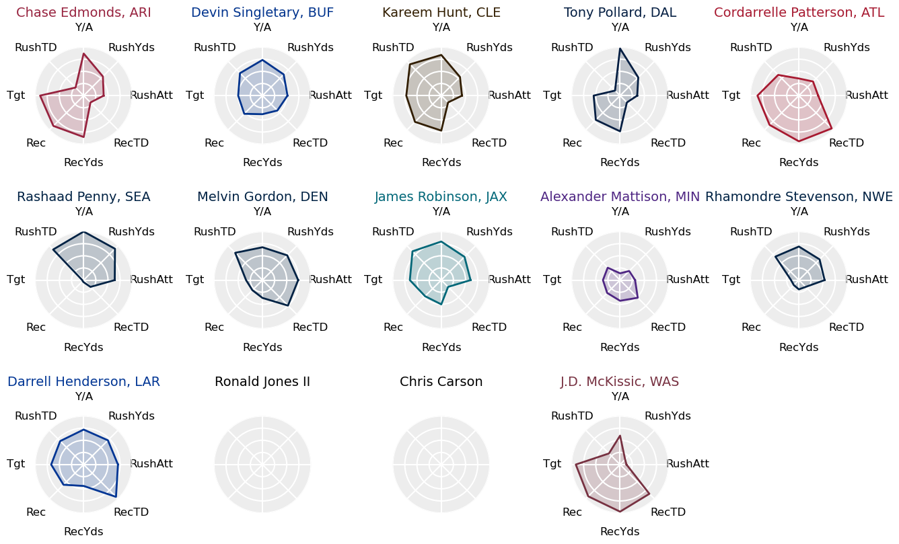
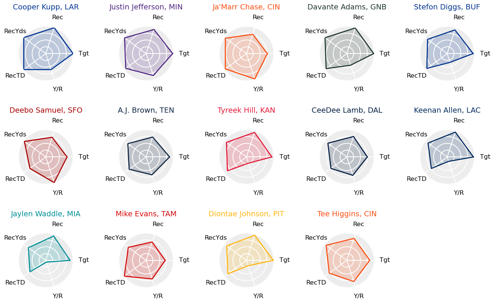
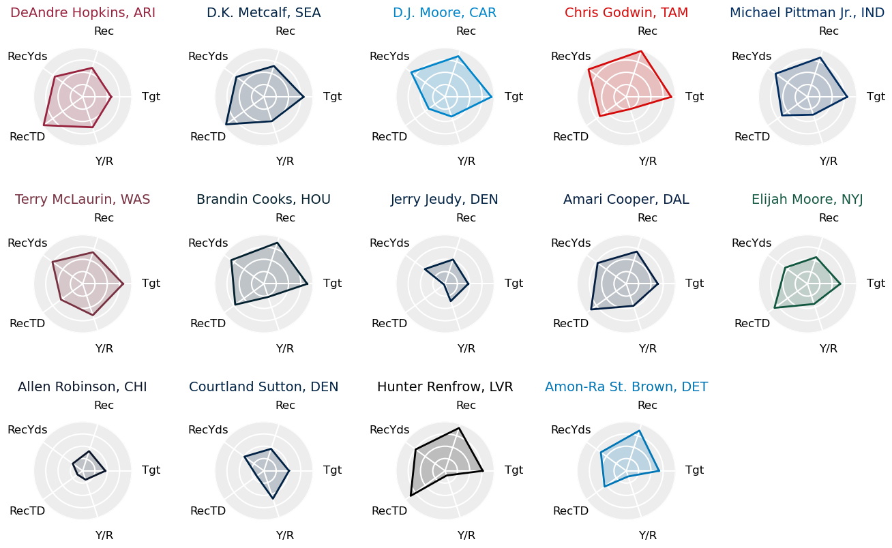
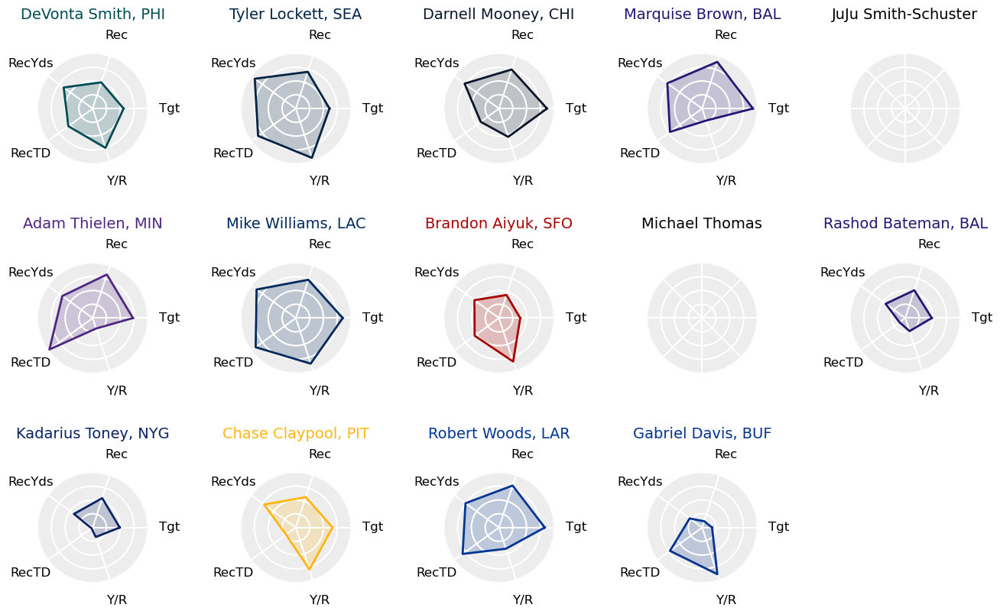
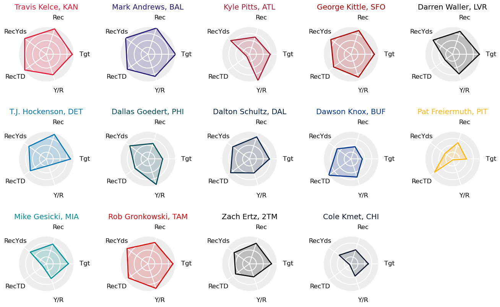
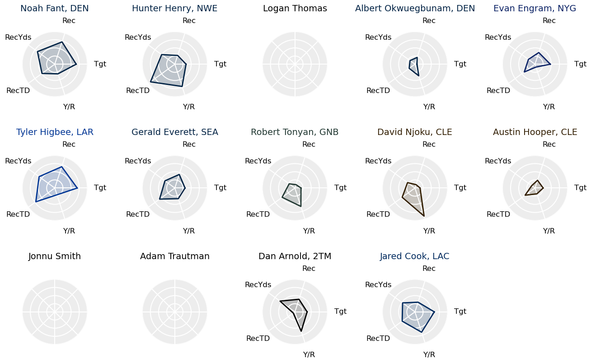

# Web Scraping & Fantasy Football Stats Visualizations Project

## Introduction

As a scientist and an avid sports fan, I love fantasy sports. Given the huge amounts of data available about each player and team in a given professional sports league, it is an excellent venue use data to discover trends and insights. For a data enthusiast like myself, the possibilities are virtually endless. 

The problem is that while it is easy to find publicly available data, it is often not in a format usable for any sort of analysis or simple visualization. For this reason, I wanted to take the opportunity to try out web scraping techniques to create my own datasets. I set out to write an algorithm that could extract NFL player data from this past season (2021-22) while being simple enough to be easily adapted for future use in data extraction from other sources. To accomplish this, I used Python with the Beautiful Soup package to extract data from the pro-football-reference.com website.

Finally, after the web scraping was successfully performed, I obviously wanted to do something with my shiny new data set. To start, I decided to make some visualizations of the player stats most relevant to fantasy football for each major position group. More sophisticated analysis using machine learning techniques is coming soon in future projects!

The data visualizations that were created are in the form of radar charts (or, as I know them, "spider graphs") showing each player's percentile scores in the major statistical categories for their position group. Spider graphs are commonly used to visualize the combine performance of NFL draft prospects, so I thought that it would be an interesting exercise to extend their use to fantasy-relevant data. In the "Results & Analysis" section, I present the spider graphs most of the projected contributors in fantasy drafts for this upcoming NFL season and discuss some observations that can be made.

####Technical skills used in this project:

Python (Pandas, Matplotlib, Numpy, BeautifulSoup), Web Scraping, Data Cleaning, Plotting/Visualizations

## Code

In this section, I briefly explain how to properly execute each script and provide a short description of their capabilities. There are two scripts used for this project- one that scrapes player data and produces output CSV files, and one that reads these files and produces the data visualizations.

#### Web Scraping Algorithm

First, the data is extraced from [pro-football-reference](https://www.pro-football-reference.com/) using `scrapePlayerStats.py`. This script should work out-of-the-box and is simply executed with the command:

```
python scrapePlayerData.py
```

If successful, the script will produce 5 output CSV files- one for each major position group (quarterbacks, running backs, wide receiviers, tight ends) and one with combined fantasy football data for all players.

Some important features of the code are:

-**Lines 16-20:** The URLs containing the data tables to be scraped are entered here.
-**Lines 186-190:** The output CSV file paths are defined here.

#### Visualizations Script

Next, the extracted data is visualized with `playerVisualizationsFF.py`. This script should work out-of-the-box (when provided with a CSV file) and is simply executed with the command:

```
python playerVisualizationsFF.py
```

The output of this script will be in the form of several png image files containing spider graphs for players at each position, broken into tiers (QB1, QB2, RB1, RB2, RB3, etc.).

Some important features of the code are:

-**Line 14:** The path to the input CSV file is defined here. As the script is currently written, it will accept the fantasy data CSV file as scraped using `scrapePlayerData.py`.
-**Lines 23-35:** The player position tiers are defined here. If left unchanged, the tiers include 14 players each, as ordered by the expert-consensus fantasy draft rankings from [FantasyPros.com](https://www.fantasypros.com/).
-**Lines 84-91:** Data selections are made here. For this analysis, percentile rankings were calculated including only player who appeared in 7 or more games and registered at least 5 PPR fantasy points per game. These selections serve to remove fantasy-irrelevant players who would artificially drive up the percentile rankings of the players being analyzed.
-**Lines 250, 258:** The output file paths are defined here.

## Results & Analysis

The players analyzed are divided by position and separated into tiers based on fantasy expert-consensus ranking for the upcoming season. As I play in a 14-team fantasy football league, I naturally divided the players up such that the top 1-14 players at each postion are in tier 1, 15-28 are in tier 2, and so on. The percentile rankings of each stat are still calculated using all players in the sample who meet the data selection requirements of having appeared in at least 7 games and accounted for at least 5 PPR points per game.

Note that some players projected to be top fantasy contributors in this upcoming season did not meet the data selection criteria from this past season, and in this case their spider graphs are left blank.

Without further ado, let's see how the top NFL players stacked up against each other (with some extra attention paid to fantasy football implications)!

#### Quaterbacks




#### Running Backs





#### Wide Receivers





#### Tight Ends


